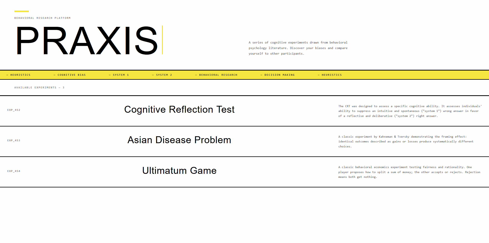
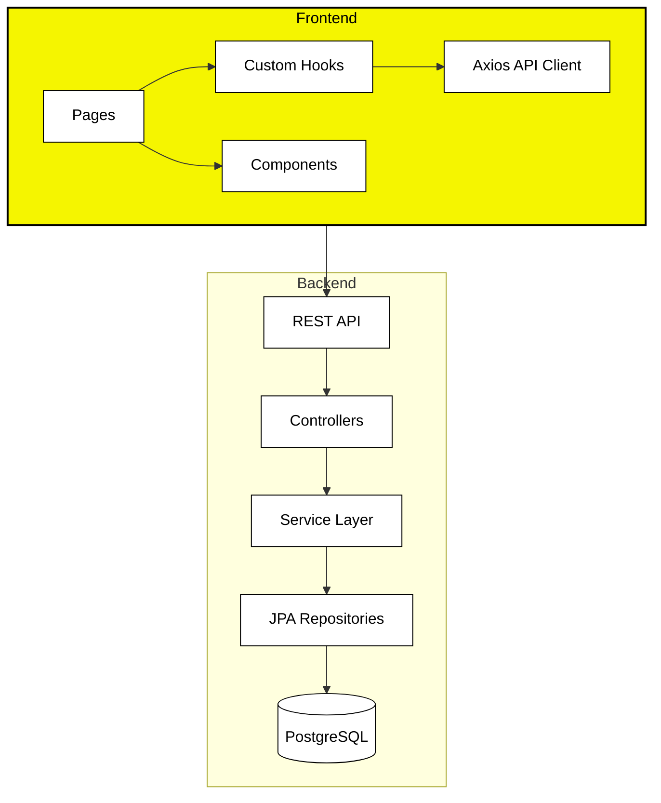
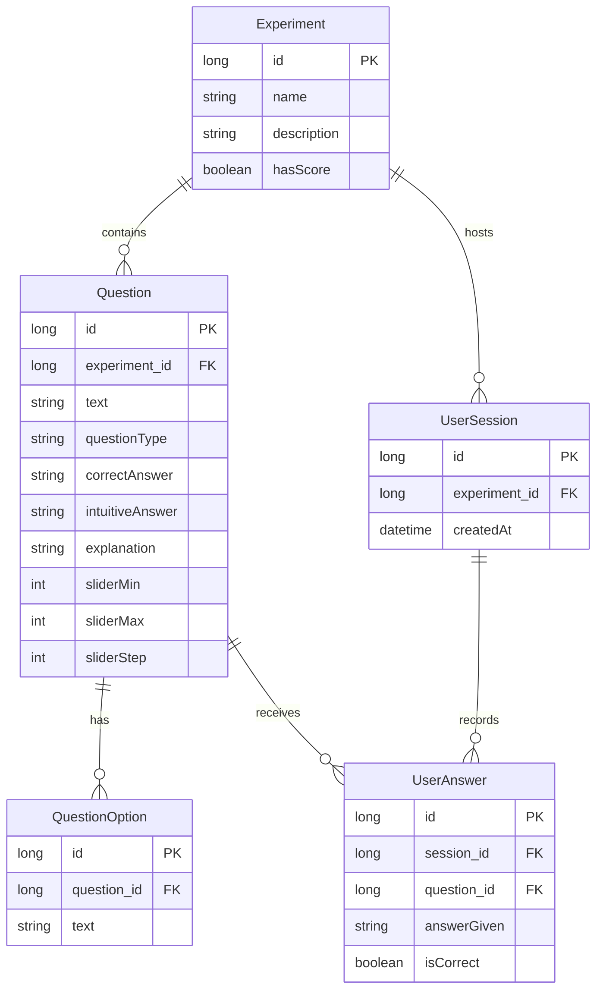
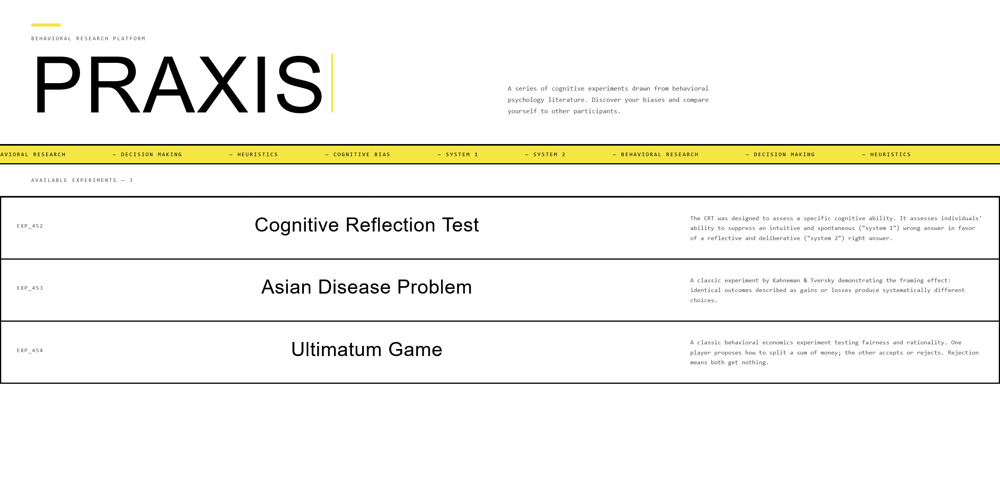
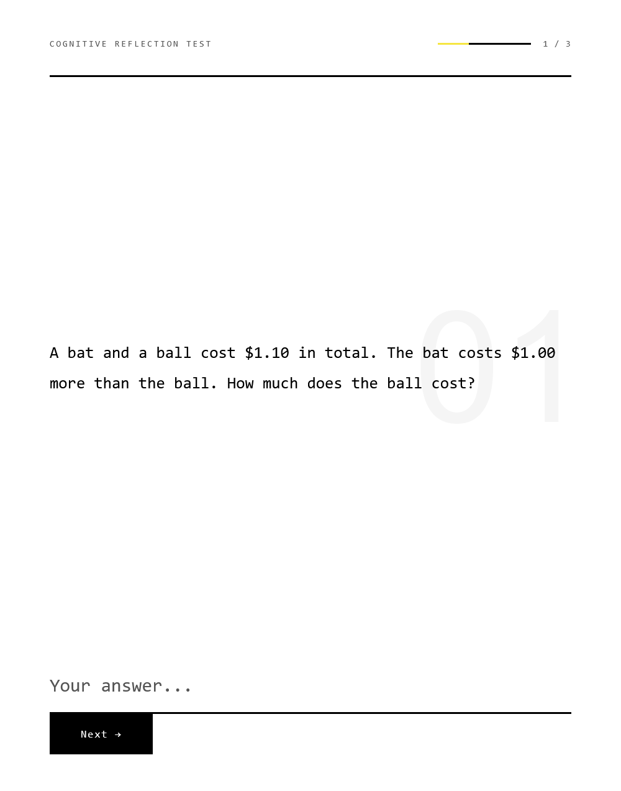
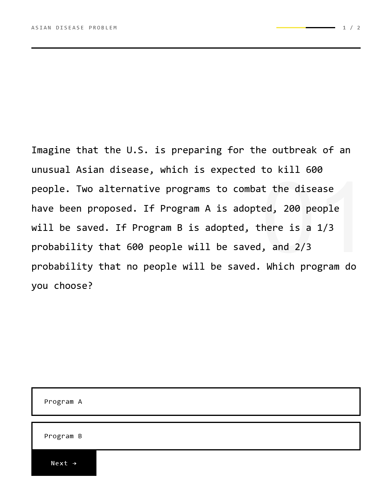
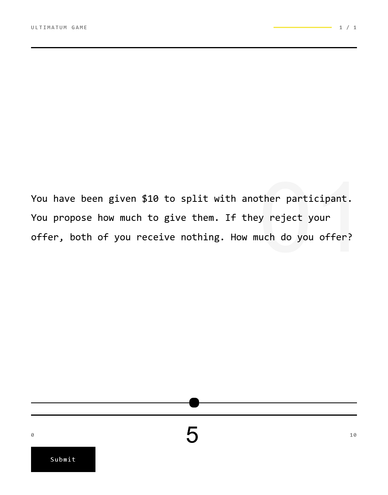
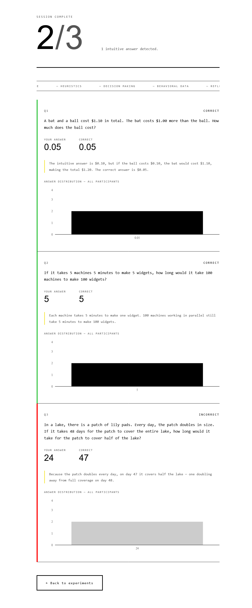

# Praxis

A full-stack behavioral psychology experiment platform built to showcase production-ready full-stack development across a Spring Boot backend and a React frontend.

Participants complete experiments drawn from peer-reviewed behavioral science literature, submit their responses, and receive immediate feedback alongside aggregated response distributions from all previous participants — making the dataset richer with every session.

---



## 🧪 Experiments

| Experiment | Type | Source |
|---|---|---|
| **Cognitive Reflection Test** | Free-text numeric input | Frederick, S. (2005). *Journal of Economic Perspectives* |
| **Asian Disease Problem** | Single choice | Tversky & Kahneman (1981). *Science* |
| **Ultimatum Game** | Slider | Güth et al. (1982). *Journal of Economic Behavior* |

### Architectural Note | Answer Distribution
`answerDistribution` exposes pre-aggregated response data across **all user sessions**. Every time a participant completes a question, their answer is recorded and immediately reflected in the distribution chart shown to subsequent users. As the dataset grows, each question reveals genuine behavioral patterns rather than isolated individual responses.

---

## 🛠️ Architecture & Design



### Backend
The backend follows a strict layered architecture with full separation of concerns:

- **Entities → DTOs** — domain model never exposed directly; dedicated request/response DTOs for every endpoint
- **Service layer** — all business logic isolated from controllers; DTO mapping via Java streams
- **Global exception handling** — `@ControllerAdvice` with `ResourceNotFoundException` for consistent error responses
- **Seed guard** — `CommandLineRunner` with per-experiment `existsByName()` check prevents duplicate seeding on restart

### Frontend
- **Custom hooks** — `useExperiment` and `useResult` encapsulate all API calls and state management
- **Conditional rendering** — `QuestionType` enum drives input component selection (`FreeTextInput`, `SingleChoiceInput`, `SliderInput`)
- **CSS Modules** — scoped styles per component, zero global leakage

---

## 🗄️ Data Model



---

## 📸 Screenshots

### Home — Experiment Selection


### Experiment — Cognitive Reflection Test


### Experiment — Asian Disease Problem


### Experiment — Ultimatum Game


### Results Page


---

## 🔧 Getting Started

### Prerequisites
- **Java 26**
- **Maven**
- **Node.js 18+**
- **Docker**

### Backend

1. Clone the repository:
   ```bash
   git clone https://github.com/SydBrain/praxis.git
   cd praxis
   ```

2. Start PostgreSQL via Docker:
   ```bash
   docker-compose up -d
   ```

3. Run the backend:
   ```bash
   ./mvnw spring-boot:run
   ```

   On first startup, the `CommandLineRunner` seeds all three experiments automatically.

### Frontend

```bash
cd frontend
npm install
npm run dev
```

The frontend runs on `http://localhost:5173` and proxies API calls to `http://localhost:8080`.

---

## 🧰 Tech Stack

| Layer | Technology |
|---|---|
| Backend | Spring Boot 4.x, Java 26, JPA/Hibernate, Lombok |
| Database | PostgreSQL 16 (Docker) |
| Frontend | React, TypeScript, Vite, Tailwind CSS v4 |
| UI | Framer Motion, Recharts, CSS Modules |
| Fonts | Bebas Neue, IBM Plex Mono |

